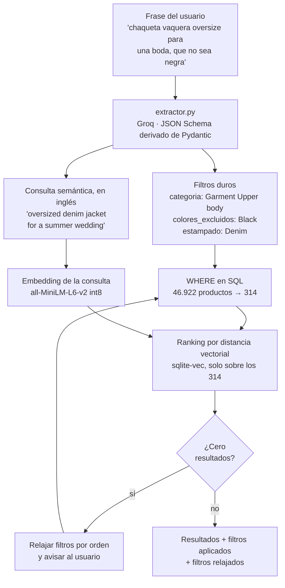

# Buscador de ropa por lenguaje natural

Escribe lo que buscas como se lo dirías a un dependiente —
*"chaqueta vaquera oversize para una boda en verano, que no sea negra"*—
y el buscador devuelve prendas reales de un catálogo de 105.000 artículos
de H&M.

**Demo en vivo: https://buscador-ropa.onrender.com**

> El servidor está en el plan gratuito de Render, que duerme el servicio tras
> 15 minutos sin visitas. Un workflow de GitHub Actions lo mantiene despierto
> de 09:00 a 23:00 (hora española), así que en ese horario responde en unos
> 3 segundos. Fuera de él, la primera carga tarda cerca de un minuto.
>
> La ventana es de 14 horas y no de 24 a propósito: Render da 750 horas de
> instancia al mes y un mes tiene 730, así que tenerlo despierto siempre
> consumiría la cuota entera —y al agotarla el servicio queda suspendido hasta
> el mes siguiente—. Ver [`.github/workflows/mantener-despierto.yml`](.github/workflows/mantener-despierto.yml).

<!-- TODO: GIF de la demo aquí -->

---

## El problema

Un buscador por palabras clave falla con esa frase. "Oversize" no aparece en
ninguna columna, "boda" tampoco, y "que no sea negra" es una negación que un
`LIKE` no entiende.

Un buscador puramente vectorial —convertir la frase en un vector y buscar los
más parecidos— falla de otra manera, y es más difícil de ver porque devuelve
resultados que *parecen* razonables. Dos ejemplos medidos sobre este catálogo:

| Consulta | Solo vectores | Híbrido |
|---|---|---|
| "zapatillas para correr de hombre" | pantalones de chándal (*joggers*) | zapatillas |
| "pijama de niño" | pijamas de mujer | pijamas de niño |

Los vectores capturan el parecido general pero no respetan restricciones
duras. *Jogger* se parece mucho a *runner*, y un tercio del catálogo es ropa
infantil, así que sin filtro de público la ropa de bebé invade cualquier
consulta.

## La solución: búsqueda híbrida

Un LLM traduce la frase a **filtros estructurados** más una **consulta
semántica**. Los filtros se aplican como `WHERE` en SQL; la consulta semántica
ordena por similitud vectorial **solo lo que ha sobrevivido al filtro**.



**El orden importa, y es la decisión central del proyecto.** Filtrar primero y
ordenar después, no al revés. Si se buscaran los *k* vecinos más próximos de
todo el catálogo y luego se filtraran, los filtros se comerían parte de esos
*k* y una consulta muy restringida devolvería casi nada. Por eso el ranking no
usa el KNN de `sqlite-vec` sino `vec_distance_L2` sobre los candidatos: es
exacto sobre el subconjunto, y se comprobó que da las mismas distancias.

## Nunca te fíes del LLM

Es la parte del proyecto que más merece la pena mirar. Un modelo de lenguaje
puede devolver cualquier cosa, y aquí su salida acaba en una consulta SQL.
Tres niveles de defensa, y **ninguno lanza una excepción hacia arriba**:

| Qué falla | Qué se hace |
|---|---|
| Un campo trae un valor fuera del enum (`"Turquesa"` en vez de `"Turquoise"`) | Se descarta **ese campo**, el resto de la consulta sigue |
| El JSON viene roto, o Groq no responde | Un reintento |
| El reintento también falla | La frase original como consulta semántica: la búsqueda degrada a puramente vectorial, que sigue devolviendo algo útil |

Detalles que sostienen esto:

- **El JSON Schema que ve el LLM se genera desde Pydantic**, no se escribe a
  mano. Duplicar los valores de los enums en el prompt significaría que, el día
  que cambie `models.py`, el modelo seguiría emitiendo valores que la base de
  datos ya no tiene — y sin que nada falle de forma visible.
- **Ningún valor se interpola en el SQL.** Todo va como parámetro, aunque los
  `Literal` de Pydantic ya garanticen el valor: depender de la validación de la
  capa de arriba para evitar inyección en esta es confiar de más.
- **Cero resultados es un buscador roto.** Si los filtros no dejan nada, se
  relajan por orden de rigidez —`estampado`, `tono`, `colores`, `categoria`, y
  `publico` el último— y **se le dice al usuario** cuáles se soltaron.
  `colores_excluidos` no se relaja nunca: devolverle justo lo que rechazó es
  peor que no devolverle nada.
- **Se registran en logs la frase y los filtros extraídos.** Es lo único que
  permite depurar un prompt con consultas reales.

El panel lateral de la interfaz enseña el JSON que devolvió el modelo y tacha
los filtros que hubo que relajar. No es información de depuración escondida:
es lo que convierte la demo de *"parece magia"* a *"se ve la ingeniería"*.

## Stack

| Capa | Elección | Por qué |
|---|---|---|
| API | FastAPI + uvicorn | tipado, `/docs` gratis |
| BD | SQLite + `sqlite-vec` | cero instalación, un solo fichero |
| Acceso a datos | `sqlite3` de la stdlib, SQL a mano | sin ORM: el SQL es parte de lo que se quiere enseñar |
| Embeddings | `onnxruntime` + `tokenizers`, `all-MiniLM-L6-v2` int8 | 99 MB en RAM en vez de 451 (ver abajo) |
| LLM | Groq, `openai/gpt-oss-120b` | capa gratuita, JSON Schema con `strict` |
| Front | Jinja2 + HTMX | sin build step, sin `node_modules` |
| Tests | pytest | 87, más uno de integración contra Groq |

## Cómo se pasó de 451 MB a 138 MB

El primer despliegue murió con **`Out of memory`** en los 512 MB del plan
gratuito. Midiendo por partes, el culpable no era el que parecía:

| | Multilingüe | Solo inglés |
|---|---|---|
| Vocabulario | 250.002 tokens | 30.522 |
| **Tokenizador en RAM** | **262 MB** | **8 MB** |
| Sesión ONNX | 140 MB | 36 MB |
| App completa bajo carga | ~500 MB → OOM | **138 MB** |

**El tokenizador pesaba más que el modelo.** Su fichero ocupa 8,7 MB en disco,
pero construir en memoria un vocabulario multilingüe de 250.002 tokens cuesta
262 MB.

La salida no fue pagar un servidor más grande, sino quitar el requisito: el
LLM **ya** estaba reescribiendo la frase, así que pedirle que la devuelva en
inglés no cuesta ni una llamada más. Con eso el buscador compara inglés contra
inglés —las descripciones del catálogo lo están— y basta un modelo monolingüe
cinco veces más pequeño.

Y salió **mejor, no solo más pequeño**: es el cambio que arregló lo de las
zapatillas y los pijamas de la tabla del principio. Comparar dentro de un mismo
idioma está mejor planteado que cruzar dos, y un modelo monolingüe del mismo
tamaño es más fuerte en su idioma.

El modelo va además cuantizado a **int8** (113 MB → 23 MB) y ejecutado con
`onnxruntime` en vez de PyTorch, que son 490 MB de librería por sí solo. El
coste de cuantizar se midió sobre el catálogo completo: el mejor resultado del
modelo en `fp32` seguía apareciendo en el top-10 en las diez consultas de
prueba, aunque el orden exacto solo coincidiera 6 de 10 veces. Es decir, el
ranking se reordena pero no se pierden resultados buenos — lo esperable en un
catálogo con miles de prendas casi idénticas.

## Instalación (Windows)

Solo necesitas Python 3.13. El modelo y la base de datos ya indexada se
descargan con dos scripts, así que no hace falta bajar el dataset de Kaggle
salvo que quieras reconstruirla tú (ver el final de esta sección).

```powershell
git clone https://github.com/Fernando80976/ropa.git
cd ropa

python -m venv .venv
.\.venv\Scripts\Activate.ps1
pip install -r requirements.txt

python preparar_modelo.py    # baja el modelo de embeddings a modelo_onnx\
python preparar_datos.py     # baja ropa.db ya indexada (110 MB)
```

Crea un `.env` con tu clave de [Groq](https://console.groq.com) (capa gratuita):

```
GROQ_API_KEY=gsk_...
DB_PATH=ropa.db
```

Y arranca:

```powershell
uvicorn main:app --reload      # http://127.0.0.1:8000
pytest -q                      # 87 tests, sin red
pytest -q -m integracion       # llama a Groq de verdad
```

Para reconstruirla desde cero en vez de descargarla hace falta `articles.csv`
del [dataset de H&M en Kaggle](https://www.kaggle.com/competitions/h-and-m-personalized-fashion-recommendations/data)
en la carpeta del proyecto. Son unos 20 minutos de indexado:

```powershell
python ingest.py --limite 0
python embeddings.py
```

## Limitaciones conocidas

- **No hay precio.** `articles.csv` no lo trae: vive en
  `transactions_train.csv` como precio por transacción y normalizado, sin
  equivalencia directa a euros. Queda fuera del alcance.
- **No hay fotos.** El dataset las reparte en una carpeta de varias decenas de
  GB que no se descarga. Cada tarjeta muestra en su lugar una muestra del color
  de la familia y la distancia vectorial del resultado.
- **El catálogo está en inglés** y la taxonomía es la interna de H&M
  (*"Divided"*, *"Womens Everyday Basics"*). Por eso `department_name` (250
  valores) y `section_name` (56) no son filtros: un usuario no habla así.
- **`Sport` compite con el género.** El dataset lo mete dentro de
  `index_group_name`, junto a *Ladieswear* y *Menswear*, así que filtrar por
  ropa deportiva pierde el género y viceversa. Es una limitación de la fuente.
- **Si Groq se cae**, la búsqueda sigue funcionando pero degrada: sin filtros
  duros, y con la frase en español contra un modelo que solo entiende inglés.
- **El servidor se duerme** a los 15 minutos en el plan gratuito de Render.

## Roadmap

- [ ] Fotos de producto, sirviéndolas como miniaturas desde el dataset.
- [ ] Precio calculado desde `transactions_train.csv`.
- [ ] Caché de consultas frecuentes, para no pagar una llamada al LLM por cada
      búsqueda repetida.
- [ ] Búsqueda por imagen con CLIP.
- [ ] Medir la calidad del buscador con un conjunto de consultas etiquetadas,
      en vez de a ojo.

## Estructura

```
models.py        SearchFilters: el contrato entre el LLM y la BD
db.py            conexión, carga de sqlite-vec, esquema
ingest.py        articles.csv -> SQLite
embeddings.py    vectores, con onnxruntime (sin torch)
extractor.py     frase -> SearchFilters vía Groq
buscador.py      fusión: filtros SQL + ranking semántico + relajado
main.py          app FastAPI y rutas
templates/       Jinja2 + HTMX
tests/           87 tests
```
